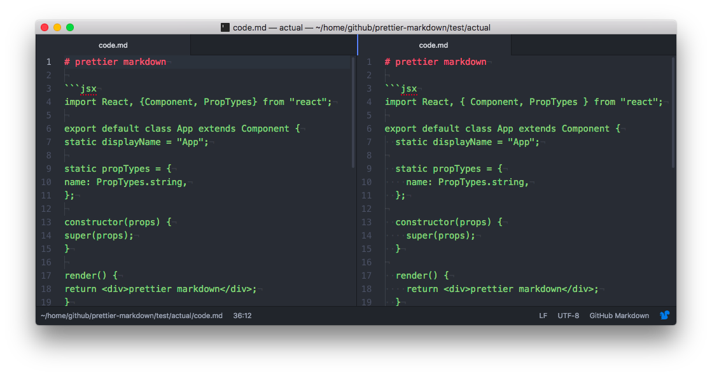

Prettier Markdown
=================

[](https://travis-ci.org/noyobo/prettier-markdown) [](https://codecov.io/gh/noyobo/prettier-markdown/branch/master) [](https://www.npmjs.org/package/prettier-markdown) [](https://npmjs.org/package/prettier-markdown)

[Prettier](https://github.com/prettier/prettier) JavaScript code in markdown.

#### before / after



## Usage 

```
yarn global add prettier-markdown
```

```
npm install [-g] prettier-markdown
```

##  CLI

Run prettier-markdown through the CLI with this script.

```bash
prettier-markdown ./**/*.md

# Short command
pmd ./**/*.md
```

## API

If has `callback` argument, otherwise return a Promise object.

`prettierMarkdown(markdownFile [,options] [, callback])`

```js
const prettierMarkdown = require('prettier-markdown');

prettierMarkdown('./foo.md', function(err, msg) {
  console.log(msg);
});

// promise
const promise = prettierMarkdown(
  './foo.md',
  {
    /* options */
  }
);
promise.then(msg => console.log);
```

## Options

TODO

