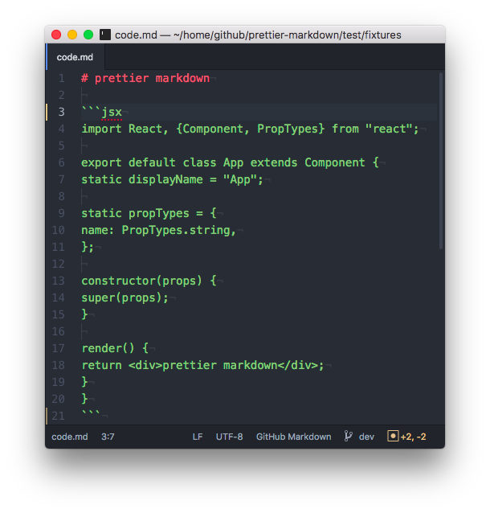
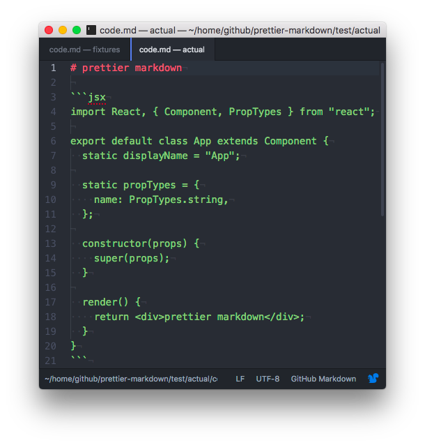

Prettier Markdown
=================

[](https://travis-ci.org/noyobo/perttier-markdown) [](https://codecov.io/gh/noyobo/perttier-markdown/branch/master) [](https://www.npmjs.org/package/perttier-markdown) [](https://npmjs.org/package/perttier-markdown)

Prettier JavaScript code in markdown.



## Usage 

```
yarn global add prettier-markdown
```

```
npm install [-g] prettier-markdown
```

##  CLI

Run prettier-markdown through the CLI with this script.

```bash
prettier-markdown ./**/*.md

# Short command
pmd ./**/*.md
```

## API

If has `callback` argument, otherwise return a Promise object.

`perttierMarkdown(markdownFile [,optoins] [, callback])`

```js
const perttierMarkdown = require('prettier-markdown');

perttierMarkdown('./foo.md', function(err, msg) {
  console.log(msg);
});

// promise
const promise = perttierMarkdown('./foo.md', {/* options */});
promise.then(msg => console.log)
```

## Options

TODO

